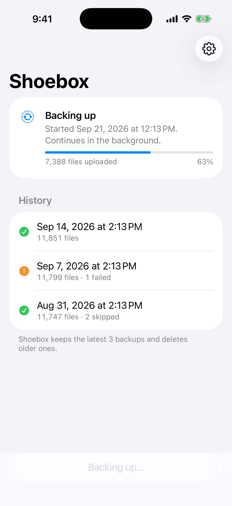
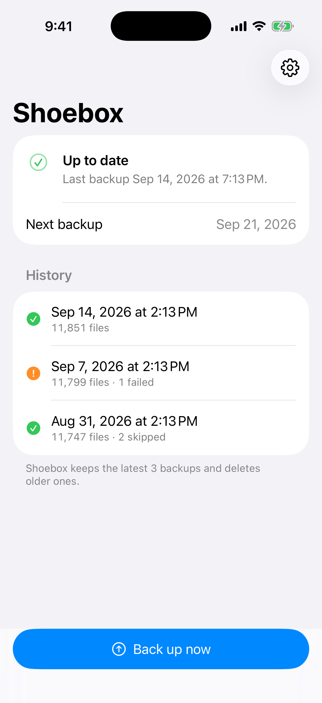
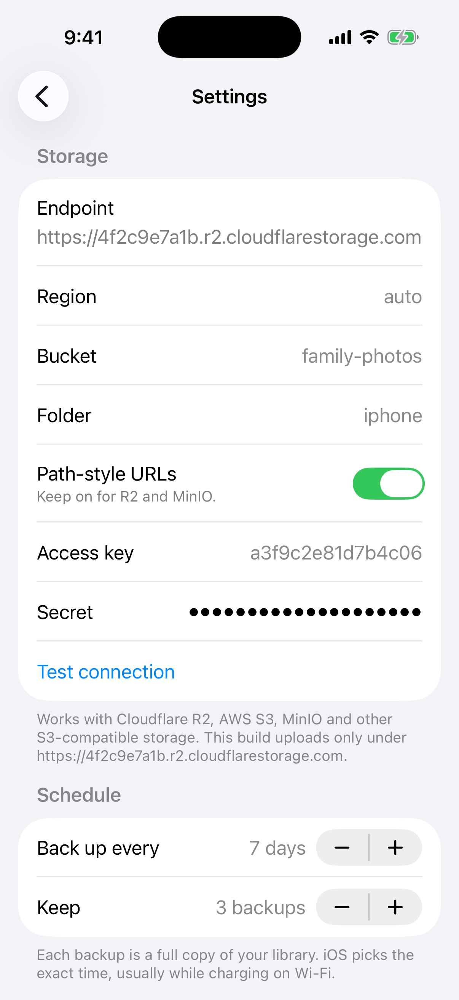
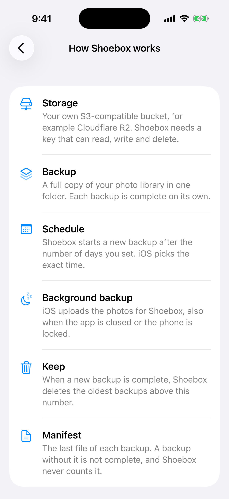
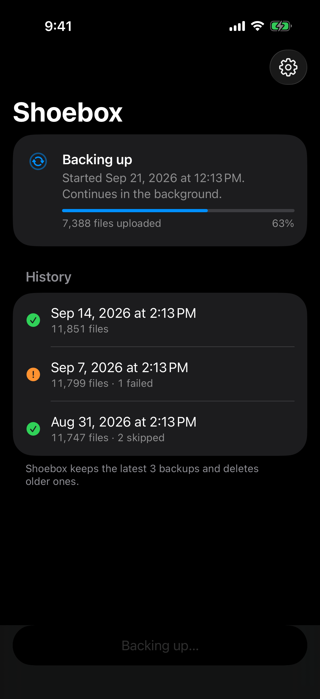
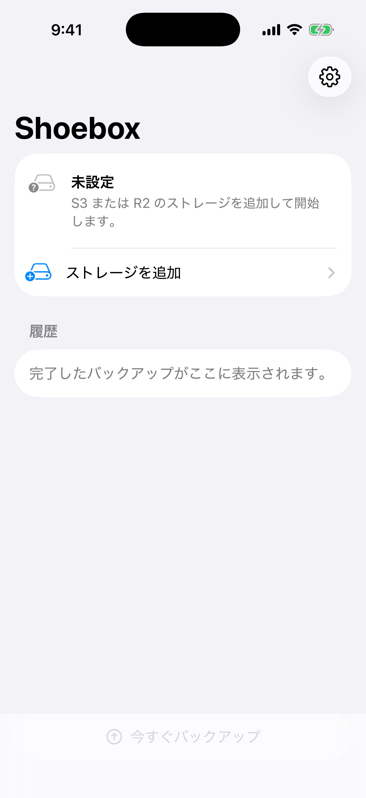

# Shoebox

[](https://github.com/jstdlee/shoebox/actions/workflows/ci.yml)

A small iOS app (Swift, iOS 26.1+) that backs up the whole photo library to
S3-compatible storage, such as Cloudflare R2, AWS S3, MinIO or Backblaze B2, **in the background**.

- **Full backup per run**: every run is a snapshot, a complete copy of the library
  under `snapshots/<timestamp>/`.
- **Every N days**: iOS schedules the work, usually while charging on Wi-Fi.
- **Keep latest X**: older snapshots are deleted automatically.
- **No encryption** and no third-party dependencies. The app uses only Apple frameworks.

## Gallery

Screenshots come from the app's demo mode. CI makes them again on every push to `main`.

| Backing up | Up to date | Settings |
|---|---|---|
|  |  |  |
| **Help** | **Dark mode** | **First run (日本語)** |
|  |  |  |

The app follows Apple's iOS patterns: a large-title status screen with the main action in thumb
reach, settings one tap away, SF Symbols, Dynamic Type, haptics, VoiceOver labels, and
English, 简体中文, 日本語 and 한국어.

## How it works

Uploads use PhotoKit's **Background Resource Upload extension** (iOS 26.1). The app
never reads photo bytes itself. It tells iOS "upload this resource to this URL", and
the system does the transfer when conditions allow, even with the app closed or the
phone locked. Each upload URL is an S3 **presigned PUT**, valid for up to 7 days.

```
iOS wakes extension ─┐       ┌─ app opened / Back up now / BG refresh
                     ▼       ▼
             BackupEngine.run()  (one bounded pass, file-locked)
   1. acknowledge finished jobs → record uploaded / retry / failed
   2. no active snapshot and due? → freeze asset list (plan)
   3. create presigned-PUT jobs up to PHAssetResourceUploadJob.jobLimit
   4. all done → PUT manifest.json (marks the snapshot complete)
   5. delete snapshots beyond "keep latest"
```

Bucket layout:

```
<prefix>/snapshots/20260929T020000Z/manifest.json
<prefix>/snapshots/20260929T020000Z/2026/09/IMG_1234_1a2b3c4d.HEIC
<prefix>/snapshots/20260929T020000Z/2026/09/IMG_1234_1a2b3c4d.MOV         (Live Photo)
<prefix>/snapshots/20260929T020000Z/2026/09/IMG_1234_1a2b3c4d_edited.HEIC
```

The suffix is a hash of the photo's library ID. It keeps each file name stable across
snapshots and prevents `IMG_0001` collisions.

## Layout

```
ShoeboxCore/                  Swift package: logic without PhotoKit
  Sources/ShoeboxCore/S3/     SigV4, S3 client, XML, config
  Sources/ShoeboxCore/Backup/ engine, key layout, schedule, retention, state files
  Tests/ShoeboxCoreTests/     149 XCTests (AWS SigV4 vectors, engine scenarios with fakes)
iOS/Shared/                   PhotoKit adapters, Keychain/App Group settings, engine factory
iOS/UploadExtension/          PHBackgroundResourceUploadExtension entry point
iOS/App/                      SwiftUI app (one settings/status screen)
project.yml                   XcodeGen project (app + extension + package)
.github/workflows/ci.yml      tests, Simulator + device builds, gallery screenshots
scripts/pick-simulator.sh     CI: choose an iPhone simulator
scripts/screenshots.sh        CI: demo-mode screenshots for the gallery
scripts/restore.sh            list / download snapshots with the AWS CLI
docs/TEST_PLAN.md             automated coverage + on-device scenarios
```

## CI

GitHub Actions (`macos-26`, newest Xcode) does these steps on every push and pull request:

1. Run the ShoeboxCore tests on an iPhone Simulator.
2. Generate the Xcode project with XcodeGen.
3. Build the app and the upload extension for the Simulator and for a device (unsigned).
4. Take the gallery screenshots in demo mode. On `main`, commit them when they change.

To run the tests on a Mac:

```bash
cd ShoeboxCore
xcodebuild test -scheme ShoeboxCore -destination 'platform=iOS Simulator,name=iPhone 17'
```

To see demo mode, launch the app with `-demo active`, `idle`, `settings`, `help` or `setup`.

## Build the app (Mac, Xcode 26.1+)

1. Edit `project.yml`:
   - `SHOEBOX_BUNDLE_ID`: your bundle id.
   - `SHOEBOX_UPLOAD_URL_BASE`: your endpoint, e.g. `https://<ACCOUNT_ID>.r2.cloudflarestorage.com`.
     Apple requires this in the extension's Info.plist, and uploads outside it are refused.
   - `DEVELOPMENT_TEAM`.
2. `brew install xcodegen && xcodegen generate && open Shoebox.xcodeproj`
3. In the Apple Developer portal, register the App Group `group.<bundle id>` for both
   the app and `<bundle id>.upload`. Xcode's automatic signing usually does this for you.
4. Run on a **real device**. The extension does not run in the Simulator.
5. In the app: fill in the storage fields, tap **Test connection**, **Save**, then
   **Turn on background backup** (full photo access), then **Back up now**.

If XcodeGen can't create the ExtensionKit target, add it by hand: File → New →
Target → Generic Extension named `ShoeboxUpload`. Add `iOS/UploadExtension` and
`iOS/Shared`, and set these Info.plist keys: `EXAppExtensionAttributes.EXExtensionPointIdentifier =
com.apple.photos.background-upload`, `BackgroundUploadURLBase`, `ShoeboxAppGroup`,
`ShoeboxKeychainGroup`. Use the same App Group and Keychain group entitlements as the app.

### Cloudflare R2 setup

- R2 → Create bucket (e.g. `photos`).
- R2 → Manage API tokens → **Object Read & Write**, scoped to that bucket.
- Endpoint `https://<ACCOUNT_ID>.r2.cloudflarestorage.com`, region `auto`, path style on.

## Restore

```bash
export AWS_ACCESS_KEY_ID=... AWS_SECRET_ACCESS_KEY=... AWS_DEFAULT_REGION=auto
export S3_ENDPOINT=https://<ACCOUNT_ID>.r2.cloudflarestorage.com S3_BUCKET=photos S3_PREFIX=iphone
scripts/restore.sh list
scripts/restore.sh latest ./restore
```

## Known limits and risks

- **iOS decides when uploads run.** "Every N days" means "not before N days", not an exact time.
- **iCloud Photos:** there is a developer-forum report that the extension is never scheduled
  when iCloud Photos is on. Test this first (TEST_PLAN C9).
- **Files over 5 GiB** (long 4K videos) exceed S3's single-PUT limit, so they fail and are listed
  in the manifest. Multipart upload isn't possible through the system uploader.
- **Full backups re-upload everything each time**, so storage grows by about library size × keep latest.
- **The endpoint is fixed per build** (`BackgroundUploadURLBase`).
- **iOS 27** replaces the extension protocol with an async one. 26.1's still works but is
  deprecated; see the comment in `ShoeboxUploadExtension.swift`.
- CI proves that the app compiles and the core logic works. It can't prove background uploads:
  the extension doesn't run in the Simulator. Use `docs/TEST_PLAN.md` on a real iPhone.
